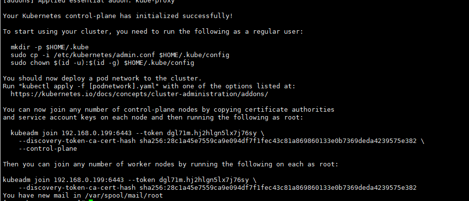

## 环境规划
| 系统           | IP地址        | 角色   |CPU|Menmory |Hostname
| :-------------: |:-------------:| :-----:|:---:|:-------:|:----:
| centos 7.6    | 192.168.2.11 | k8s-master |4c  |6G |k8s-master1|
| centos 7.6    | 192.168.2.21 | k8s-master |4c  |6G |k8s-node1|
| centos 7.6    | 192.168.2.22 | k8s-master |4c  |6G |k8s-node2|


## 安装所需文件
```bash
# 安装所需脚本
https://github.com/sweet-red/kubernetes.git
```
## 系统初始化
### 运行系统初始化脚本
```bash
sh k8s_init-2021_new.sh

#初始化脚本说明：
1.yum_config: 配置阿里云base/epel源及安装基础工具
2.yum_k8s_config: 配置阿里云k8s源
3.iptables_config: 关闭系统自带firewalld,安装iptables
4.selinux_config: 关闭selinx
5.ulimit_config: 修改系统打开文件数
6.time_config: 配置时间同步
7.sysctl_config: 配置k8s相关系统参数
8.swap_config: 关闭swap
9.kernel_config: 升级内核版本
10.docker_config: 安装docker，配置docker cgroup driver为systemd，**如果不修改k8s初始化无法正常执行
11.ipvs_config: 配置ipvs模块，k8s默认使用iptables进行转发
```
### 配置主机名、host解析、免密登录
```bash
略
```

## 安装Kubernetes集群
### 安装kubeadm、kubelet工具
```bash
# 所有节点
yum install -y kubelet-1.20.6 kubeadm-1.20.6 kubectl-1.20.6
systemctl enable kubelet
```

#### 使用国内镜像初始化如下：
```bash
# master节点
kubeadm init --kubernetes-version=1.20.6  --apiserver-advertise-address=192.168.2.11  --image-repository registry.aliyuncs.com/google_containers  --pod-network-cidr=10.244.0.0/16 --ignore-preflight-errors=SystemVerification
```

如下表示初始化成功，记住相关信息后续节点加入需用到：




按照提示执行授权
```bash
mkdir -p $HOME/.kube
sudo cp -i /etc/kubernetes/admin.conf $HOME/.kube/config
sudo chown $(id -u):$(id -g) $HOME/.kube/config
```
```bash
# 在k8s-master1节点执行
kubectl get nodes
# 显示如下，k8s-master1节点是NotReady
NAME      STATUS     ROLES    AGE     VERSION
k8s-master1   NotReady   control-plane,master    60s   v1.20.6
```

#### 添加工作节点
```bash
# node1/node2
# master执行如下命令查看token
kubeadm token create --print-join-command

kubeadm join 192.168.2.11:6443 --token 4asck2.k47woqmijjuc0hwd     --discovery-token-ca-cert-hash sha256:69f939c0eae6a81c93d04d82ef114b795f18e67723fd5291afd60586d80f6880

# node1/node2执行命令加入集群后
kubectl get nodes
NAME              STATUS   ROLES                  AGE     VERSION
k8s-master1   Ready    control-plane,master   58m     v1.20.6
k8s-node1     Ready    <none>                 5m46s   v1.20.6
k8s-node2     Ready    <none>                 5m46s   v1.20.6

# 为工作节点打标签
# node1/node2
kubectl label node k8s-node1 node-role.kubernetes.io/worker=worker
kubectl label node k8s-node2 node-role.kubernetes.io/worker=worker
```

### 安装calico
```bash
# 安装
cd k8s-1.20.6
kubectl apply -f calico.yaml

# 安装完成后
kubectl get nodes
# 显示如下，看到STATUS是Ready
NAME              STATUS   ROLES                  AGE     VERSION
k8s-master1   Ready    control-plane,master   58m     v1.20.6
k8s-node1     Ready    <none>                 5m46s   v1.20.6
k8s-node2     Ready    <none>                 5m46s   v1.20.6

kubectl get pods -n kube-system
# 看到cordns也是running状态，说明master1节点的calico安装完成
NAME                            READY   STATUS    RESTARTS   AGE
calico-node-6rvqm               1/1     Running   0          17m
coredns-7ff77c879f-j48h6        1/1     Running   0          97m
coredns-7ff77c879f-lrb77        1/1     Running   0          97m
etcd-master1                    1/1     Running   0          97m
kube-apiserver-master1          1/1     Running   0          97m
kube-controller-manager-master1 1/1     Running   0          97m
kube-proxy-njft6                1/1     Running   0          97m
kube-scheduler-master1          1/1     Running   0          97m

```
### 测试
```bash
# k8s创建pod是否可以正常访问网络
kubectl run busybox --image busybox:1.28 --restart=Never --rm -it busybox -- sh
/ # ping www.baidu.com

# k8s集群中部署tomcat服务
cd k8s-1.20.6
kubectl apply -f tomcat.yaml

# 测试DNS

kubectl run busybox --image busybox:1.28 --restart=Never --rm -it busybox -- sh
/ # nslookup kubernetes.default.svc.cluster.local
Server:    10.96.0.10
Address 1: 10.96.0.10 kube-dns.kube-system.svc.cluster.local

Name:      kubernetes.default.svc.cluster.local
Address 1: 10.96.0.1 kubernetes.default.svc.cluster.local
```

### 部署metrics-server服务
```bash
注意：这个是k8s在1.17的新特性，如果是1.16版本的可以不用添加，1.17以后要添加。这个参数的作用是Aggregation允许在不修改Kubernetes核心代码的同时扩展Kubernetes API。
#在/etc/kubernetes/manifests里面改一下apiserver的配置
vim /etc/kubernetes/manifests/kube-apiserver.yaml
增加如下内容：
- --enable-aggregator-routing=true

# 重新更新apiserver配置：
kubectl apply -f  /etc/kubernetes/manifests/kube-apiserver.yaml
kubectl get pods -n kube-system

#把CrashLoopBackOff状态的pod删除
kubectl delete pods kube-apiserver -n kube-system

# 安装metrice
cd k8s-1.20.6
kubectl apply -f metrics.yaml

kubectl get pods -n kube-system | grep metrics
metrics-server-6595f875d6-r94sx            2/2     Running   0          16s

# 测试
kubectl top node
```
### 把scheduler、controller-manager端口变成物理机可以监听的端口
默认在1.19之后10252和10251都是绑定在127的，如果想要通过prometheus监控，会采集不到数据，所以可以把端口绑定到物理机
```bash
可按如下方法处理：
vim /etc/kubernetes/manifests/kube-scheduler.yaml
修改如下内容：
把--bind-address=127.0.0.1变成--bind-address=192.168.2.11
把httpGet:字段下的hosts(两个)由127.0.0.1变成192.168.2.11
把—port=0 删除
#注意：192.168.2.11是k8s的控制节点xianchaomaster1的ip

vim /etc/kubernetes/manifests/kube-controller-manager.yaml
把--bind-address=127.0.0.1变成--bind-address=192.168.2.11
把httpGet:字段下的hosts(两个)由127.0.0.1变成192.168.2.11
把—port=0 删除

修改之后在k8s各个节点重启下kubelet
systemctl restart kubelet
[root@xianchaomaster1 prometheus]# kubectl get cs
Warning: v1 ComponentStatus is deprecated in v1.19+
NAME                 STATUS    MESSAGE             ERROR
scheduler            Healthy   ok                  
controller-manager   Healthy   ok                  
etcd-0               Healthy   {"health":"true"}

ss -antulp | grep :10251
ss -antulp | grep :10252
```
