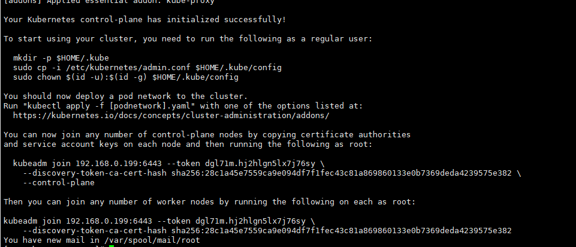

## 环境规划
| 系统           | IP地址        | 角色   |CPU|Menmory |Hostname
| :-------------: |:-------------:| :-----:|:---:|:-------:|:----:
| centos 7.6    | 192.168.0.200 | k8s-master |2c  |2G |k8s-master1|
| centos 7.6    | 192.168.0.201 | k8s-master |2c  |2G |k8s-master2|
| centos 7.6    | 192.168.0.202 | k8s-master |2c  |2G |k8s-master3|
| centos 7.6    | 192.168.0.210 | k8s-node |2c  |2G |k8s-node1|
| centos 7.6    | 192.168.0.220 | k8s-node |2c  |2G |k8s-node2|
| vip    | 192.168.0.199 | 用于三台master高可用浮动IP |-  |- |-|

## 安装所需文件
```bash
# 安装所需脚本、yaml等文件都在如下仓库
https://github.com/sweet-red/kubernetes.git
```
## 系统初始化
### 运行系统初始化脚本
```bash
sh k8s_init.sh

#初始化脚本说明：
1.yum_config: 配置阿里云base/epel源及安装基础工具
2.yum_k8s_config: 配置阿里云k8s源
3.iptables_config: 关闭系统自带firewalld,安装iptables
4.selinux_config: 关闭selinx
5.ulimit_config: 修改系统打开文件数
6.time_config: 配置时间同步
7.sysctl_config: 配置k8s相关系统参数
8.swap_config: 关闭swap
9.kernel_config: 升级内核版本
10.docker_config: 安装docker，配置docker cgroup driver为systemd，**如果不修改k8s初始化无法正常执行
11.ipvs_config: 配置ipvs模块，k8s默认使用iptables进行转发
```
### 配置主机名、host解析、免密登录
```bash
略
```
## 部署keepalived+lvs
实现api-server高可用
### 安装keepalived及相关组件 （master节点）
```bash
yum install -y socat keepalived ipvsadm conntrack
```
### 配置keepalived
```bash
# keepalived配置文件
https://github.com/sweet-red/kubernetes.git
```
### 说明
- 三个节点keepalived配置文件相同，仅优先级不同，根据实际情况修改优先级，如 100，50，30
- 6443为k8s api-server端口
- keepalive需要配置BACKUP，而且是非抢占模式nopreempt，假设master1宕机，启动之后vip不会自动漂移到master1，这样可以保证k8s集群始终处于正常状态，因为假设master1启动，apiserver等组件不会立刻运行，如果vip漂移到master1，那么整个集群就会挂掉，这就是为什么我们需要配置成非抢占模式了
- 启动顺序master1->master2->master3
- 启动成功后检查网卡是否绑定虚拟IP

## 安装Kubernetes集群
### 准备镜像
```bash
#需要如下镜像，外网下载后(需翻墙) docker load -i 导入到本地
k8s.gcr.io/kube-apiserver:v1.18.2
k8s.gcr.io/kube-controller-manager:v1.18.2
k8s.gcr.io/kube-scheduler:v1.18.2
k8s.gcr.io/kube-proxy:v1.18.2
k8s.gcr.io/pause:3.2
k8s.gcr.io/etcd:3.4.3-0        
k8s.gcr.io/coredns:1.6.7
k8s.gcr.io/metrics-server-amd64:v0.3.1
k8s.gcr.io/addon-resizer:1.8.4
quay.io/calico/cni:v3.5.3
quay.io/calico/node:v3.5.3

```
### 安装kubeadm、kubelet工具
```bash
# 所有节点
yum install kubeadm-1.18.2 kubelet-1.18.2 -y
systemctl enable kubelet
```
### 初始化kubernetes集群
首先在k8s-master1上初始化，然后再依次拷贝至k8s-master2、k8s-master3，前提是已经安装kubectl kubeadm和已导入镜像
```bash
# kubeadm-config.yaml：
# 如果不是手动导入镜像加 imageRepository: registry.aliyuncs.com/google_containers 字段
apiVersion: kubeadm.k8s.io/v1beta2
kind: ClusterConfiguration
kubernetesVersion: v1.18.2
controlPlaneEndpoint: 192.168.0.199:6443
apiServer:
 certSANs:
 - 192.168.0.200
 - 192.168.0.201
 - 192.168.0.202
 - 192.168.0.210
 - 192.168.0.220
 - 192.168.0.199
networking:
 podSubnet: 10.244.0.0/16
---
apiVersion: kubeproxy.config.k8s.io/v1alpha1
kind:  KubeProxyConfiguration
mode: ipvs

# 初始化k8s集群
kubeadm init --config kubeadm-config.yaml

```

如下表示初始化成功，记住相关信息后续节点加入需用到：


按照提示执行授权
```bash
mkdir -p $HOME/.kube
sudo cp -i /etc/kubernetes/admin.conf $HOME/.kube/config
sudo chown $(id -u):$(id -g) $HOME/.kube/config
```
```bash
# 在k8s-master1节点执行
kubectl get nodes
# 显示如下，k8s-master1节点是NotReady
NAME      STATUS     ROLES    AGE     VERSION
master1   NotReady   master   8m11s   v1.18.2
 
kubectl get pods -n kube-system
# 显示如下，可看到cordns也是处于pending状态
coredns-7ff77c879f-j48h6              0/1     Pending  0
3m16scoredns-7ff77c879f-lrb77         0/1     Pending  0          3m16s
# 上面可以看到STATUS状态是NotReady，cordns是pending，是因为没有安装网络插件，需要安装calico或者flannel，
```
### 安装calico
```bash
# 安装
kubectl apply -f calico.yaml

# 安装完成后
kubectl get nodes
# 显示如下，看到STATUS是Ready
NAME     STATUS   ROLES    AGE   VERSION
master1   Ready    master   98m   v1.18.2

kubectl get pods -n kube-system
# 看到cordns也是running状态，说明master1节点的calico安装完成
NAME                            READY   STATUS    RESTARTS   AGE
calico-node-6rvqm               1/1     Running   0          17m
coredns-7ff77c879f-j48h6        1/1     Running   0          97m
coredns-7ff77c879f-lrb77        1/1     Running   0          97m
etcd-master1                    1/1     Running   0          97m
kube-apiserver-master1          1/1     Running   0          97m
kube-controller-manager-master1 1/1     Running   0          97m
kube-proxy-njft6                1/1     Running   0          97m
kube-scheduler-master1          1/1     Running   0          97m
```
### master2/master3加入集群
```bash
在master1节点分别把证书拷贝到master2和master3上:
scp /etc/kubernetes/pki/ca.crt k8s-master2:/etc/kubernetes/pki/
scp /etc/kubernetes/pki/ca.key k8s-master2:/etc/kubernetes/pki/
scp /etc/kubernetes/pki/sa.key k8s-master2:/etc/kubernetes/pki/
scp /etc/kubernetes/pki/sa.pub k8s-master2:/etc/kubernetes/pki/
scp /etc/kubernetes/pki/front-proxy-ca.crt k8s-master2:/etc/kubernetes/pki/
scp /etc/kubernetes/pki/front-proxy-ca.key k8s-master2:/etc/kubernetes/pki/
scp /etc/kubernetes/pki/etcd/ca.crt k8s-master2:/etc/kubernetes/pki/etcd/
scp /etc/kubernetes/pki/etcd/ca.key k8s-master2:/etc/kubernetes/pki/etcd/
```
```bash
证书拷贝之后在master2和master3上执行如下命令：
kubeadm join 192.168.0.199:6443 --token 7dwluq.x6nypje7h55rnrhl \
    --discovery-token-ca-cert-hash sha256:fa75619ab0bb6273126350a9dbda9aa6c89828c2c4650299fe1647ab510a7e6c   --control-plane

--control-plane：这个参数表示加入到k8s集群的是master节点 

加入成功后按提示执行如下授权：
mkdir -p $HOME/.kube
sudo cp -i /etc/kubernetes/admin.conf $HOME/.kube/config
sudo chown $(id -u):$(id -g)$HOME/.kube/config
```
```bash
kubectl get nodes 
如下显示表示正常：
NAME     STATUS   ROLES    AGE    VERSION
master1  Ready    master   39m    v1.18.2
master2  Ready    master   5m9s   v1.18.2
master3  Ready    master   2m33s  v1.18.2
```
### node1/node2加入集群
```bash
kubeadm join 192.168.0.199:6443 --token 7dwluq.x6nypje7h55rnrhl \
    --discovery-token-ca-cert-hash sha256:fa75619ab0bb6273126350a9dbda9aa6c89828c2c4650299fe1647ab510a7e6c

kubectl get node

k8s-master1   Ready    master   23h   v1.18.2
k8s-master2   Ready    master   22h   v1.18.2
k8s-master3   Ready    master   22h   v1.18.2
k8s-node1     Ready    <none>   22h   v1.18.2
k8s-node2     Ready    <none>   22h   v1.18.2
```
### 安装dashbord组件
下载dashboard镜像，版本2.0 (所有节点)
```bash
docker pull dashboard:v2.0.0-beta8
docker pull metrics-scraper:v1.0.1
```
master1节点执行：
```bash
kubectl apply -f kubernetes-dashboard.yaml
```
查看dashboard是否安装成功：
```bash
kubectl get pods -n kubernetes-dashboard
#显示如下，说明dashboard安装成功了
NAME                                         READY   STATUS    RESTARTS   AGE  
dashboard-metrics-scraper-694557449d-8xmtf   1/1     Running   0          60s   
kubernetes-dashboard-5f98bdb684-ph9wg        1/1     Running   2          60s
```
查看dashboard前端的service
```bash
kubectl get svc -n kubernetes-dashboard
#显示如下：
NAME                       TYPE        CLUSTER-IP       EXTERNAL-IP   PORT(S)    AGE   
dashboard-metrics-scraper ClusterIP   10.100.23.9        <none>        8000/TCP   50s   
kubernetes-dashboard        ClusterIP   10.105.253.155   <none>        443/TCP    50s
```
修改service type类型变成NodePort：
```bash
kubectl edit svc kubernetes-dashboard -n kubernetes-dashboard
把 type: ClusterIP变成 type: NodePort，保存退出即可。
```
此时就可以通过任意节点 ip+NodePort 来访问，最好使用火狐浏览器

默认yaml文件里的token是没有管理员权限的，所以需创建管理员token,即可查看任意空间
```bash
#创建管理员token
kubectl create clusterrolebinding dashboard-cluster-admin --clusterrole=cluster-admin --serviceaccount=kubernetes-dashboard:kubernetes-dashboard
```
查看kubernetes-dashboard名称空间下的secret
```bash
kubectl get secret -n kubernetes-dashboard

NAME                               TYPE                                  DATA   AGE
default-token-4rqpm                kubernetes.io/service-account-token   3      2d18h
kubernetes-dashboard-certs         Opaque                                0      2d18h
kubernetes-dashboard-csrf          Opaque                                1      2d18h
kubernetes-dashboard-key-holder    Opaque                                2      2d18h
kubernetes-dashboard-token-rqd2m   kubernetes.io/service-account-token   3      2d18h
```
查看token内容：
```bash
kubectl describe secret kubernetes-dashboard-token-rqd2m -n kubernetes-dashboard

Name:         kubernetes-dashboard-token-rqd2m
Namespace:    kubernetes-dashboard
Labels:       <none>
Annotations:  kubernetes.io/service-account.name: kubernetes-dashboard
              kubernetes.io/service-account.uid: 227a9b92-b9ce-46d3-bad3-bd7a90047172

Type:  kubernetes.io/service-account-token

Data
====
ca.crt:     1025 bytes
namespace:  20 bytes
token:      eyJhbGciOiJSUzI1NiIsImtpZCI6Ink4OGdaaFF3UUo1MldkcGhTYWg0MEpHam14ZWJ3cWZKaDRiN3pPZlZOV1EifQ.eyJpc3MiOiJrdWJlcm5ldGVzL3NlcnZpY2VhY2NvdW50Iiwia3ViZXJuZXRlcy5pby9zZXJ2aWNlYWNjb3VudC9uYW1lc3BhY2UiOiJrdWJlcm5ldGVzLWRhc2hib2FyZCIsImt1YmVybmV0ZXMuaW8vc2VydmljZWFjY291bnQvc2VjcmV0Lm5hbWUiOiJrdWJlcm5ldGVzLWRhc2hib2FyZC10b2tlbi1ycWQybSIsImt1YmVybmV0ZXMuaW8vc2VydmljZWFjY291bnQvc2VydmljZS1hY2NvdW50Lm5hbWUiOiJrdWJlcm5ldGVzLWRhc2hib2FyZCIsImt1YmVybmV0ZXMuaW8vc2VydmljZWFjY291bnQvc2VydmljZS1hY2NvdW50LnVpZCI6IjIyN2E5YjkyLWI5Y2UtNDZkMy1iYWQzLWJkN2E5MDA0NzE3MiIsInN1YiI6InN5c3RlbTpzZXJ2aWNlYWNjb3VudDprdWJlcm5ldGVzLWRhc2hib2FyZDprdWJlcm5ldGVzLWRhc2hib2FyZCJ9.fcgHb4nEyfdPPaMHkwhI2q4T83RZDuK7Yx48V26Piyn1f81IbXiAY99AYsn9dQILzEe52WO6Y3FcAYqJ1B0uDGT-uGJvzJnN0-nBTrqhgE-NDMpjW_Ib1pwggjMFPMvnlGfLpubi_KQS76AEl2VUqYhPTJe-XKw6TDNKn1enYxbatAFZMPvB3sy6XGh6fG5v3O5BhpxJY83fi7n54E9ZvJEgywExuJ0uUFnTe4XuCmldq_hTSARnok2H28kOJScM-0r4pTGdwpG65bcnHRbtepDEm0AKcv8k9FMl9rwYgMHcsIjvzbTKgApF4xpy5HoKpOS23DvNb0ORdGo8HIn4XA

```
使用token登录即可

### 安装metrics组件
- metrics组件是一个资源收集的插件，可以收集物理机及pod等资源

需要镜像：
```bash
k8s.gcr.io/metrics-server-amd64:v0.3.1
k8s.gcr.io/addon-resizer:1.8.4

#不能访问外网还是需要先下载再 docker load -i 上传
```
在k8s-master节点操作：
```bash
kubectl apply -f metrics.yaml
```
查看metrics状态
```bash
kubectl get pod -n kube-system
```
上面如果看到metrics-server-8459f8db8c-5p59m是running状态，说明metrics-server组件部署成功了，接下来就可以在master1节点上使用kubectl top pods -n kube-system或者kubectl top nodes命令
