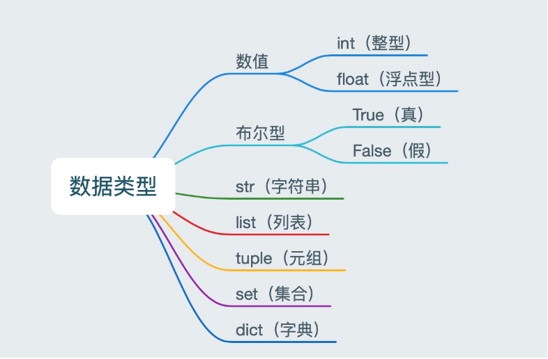

## 认识数据类型
**在 Python 里为了应对不同的业务需求，也把数据分为不同的类型。**



> 检测数据类型的方法：`type()`

```python
a = 1
print(type(a))  # <class 'int'> -- 整型

b = 1.1
print(type(b))  # <class 'float'> -- 浮点型

c = True
print(type(c))  # <class 'bool'> -- 布尔型

d = '12345'
print(type(d))  # <class 'str'> -- 字符串

e = [10, 20, 30]
print(type(e))  # <class 'list'> -- 列表

f = (10, 20, 30)
print(type(f))  # <class 'tuple'> -- 元组

h = {10, 20, 30}
print(type(h))  # <class 'set'> -- 集合

g = {'name': 'TOM', 'age': 20}
print(type(g))  # <class 'dict'> -- 字典
```
