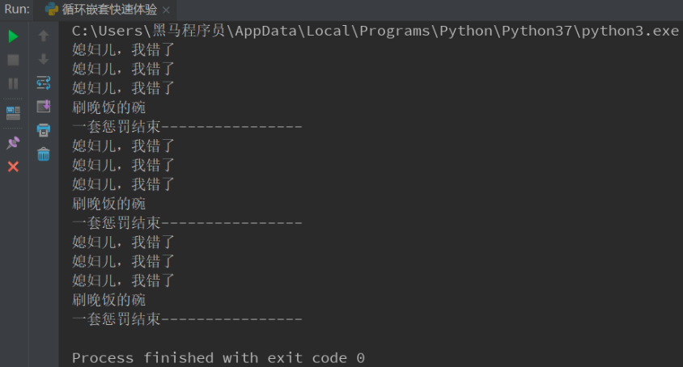

## 循环的作用
> 思考：假如我有个女朋友，有一天我们闹矛盾生气了，女朋友说：道歉，说100遍“媳妇儿，我错了”。这个时候程序员会怎么做？
>
> 答：100遍`print('媳妇儿，我错了')`

> 思考：复制粘贴100次吗？
>
> 答：重复执行100次一样的代码，程序中循环即可

循环的作用：让代码更高效的重复执行。

## while的语法
``` python
while 条件:
    条件成立重复执行的代码1
    条件成立重复执行的代码2
    ......
```
### 快速体验
需求：复现重复执行100次`print('媳妇儿，我错了')`（输出更简洁一些，我们这里设置5次）。

分析：初始值是0次，终点是5次，重复做的事情输出“媳妇儿， 我错了”。

``` python
# 循环的计数器
i = 0
while i < 5:
    print('媳妇儿，我错了')
    i += 1

print('任务结束')
```

### 应用一：计算1-100累加和
分析：1-100的累加和，即1 + 2 + 3 + 4 +….，即前两个数字的相加结果 + 下一个数字( 前一个数字 + 1)。

``` python
i = 1
result = 0
while i <= 100:
    result += i
    i += 1

# 输出5050
print(result)
```

> 注意：为了验证程序的准确性，可以先改小数值，验证结果正确后，再改成1-100做累加。

### 应用二：计算1-100偶数累加和
分析：1-100的偶数和，即 2 + 4 + 6 + 8....，得到偶数的方法如下：

- 偶数即是和2取余结果为0的数字，可以加入条件语句判断是否为偶数，为偶数则累加
- 初始值为0 / 2 , 计数器每次累加2

#### 方法一：条件判断和2取余数则累加
``` python
# 方法一：条件判断和2取余数为0则累加计算
i = 1
result = 0
while i <= 100:
    if i % 2 == 0:
        result += i
    i += 1

# 输出2550
print(result)
```

#### 方法二：计数器控制
``` python
# 方法二：计数器控制增量为2
i = 0
result = 0
while i <= 100:
    result += i
    i += 2

# 输出2550
print(result)
```

### break和continue
break和continue是循环中满足一定条件退出循环的两种不同方式。

>举例：一共吃5个苹果，吃完第一个，吃第二个…，这里"吃苹果"的动作是不是重复执行？<br>
情况一：如果吃的过程中，吃完第三个吃饱了，则不需要再吃第4个和第五个苹果，即是吃苹果的动作停止，这里就是break控制循环流程，即==终止此循环==。<br>
情况二：如果吃的过程中，吃到第三个吃出一个大虫子...,是不是这个苹果就不吃了，开始吃第四个苹果，这里就是continue控制循环流程，即==退出当前一次循环继而执行下一次循环代码==。

#### 情况一：break
``` python
i = 1
while i <= 5:
    if i == 4:
        print(f'吃饱了不吃了')
        break
    print(f'吃了第{i}个苹果')
    i += 1
```

执行结果：


#### 情况二：continue
``` python
i = 1
while i <= 5:
    if i == 3:
        print(f'大虫子，第{i}个不吃了')
        # 在continue之前一定要修改计数器，否则会陷入死循环
        i += 1
        continue
    print(f'吃了第{i}个苹果')
    i += 1
```

执行结果：


### while循环嵌套
#### 应用场景
故事梗概：有天女朋友又生气了，惩罚：说3遍“媳妇儿， 我错了”，这个程序是不是循环即可？但如果女朋友说：还要刷今天晚饭的碗，这个程序怎么书写？

``` python
while 条件:
    print('媳妇儿， 我错了')
print('刷晚饭的碗')
```

但如果女朋友还是生气，把这套惩罚要连续3天都执行，有如何书写程序？

``` python
while 条件:
    while 条件:
        print('媳妇儿， 我错了')
    print('刷晚饭的碗')
```
#### 语法
``` python
while 条件1:
    条件1成立执行的代码
    ......
    while 条件2:
        条件2成立执行的代码
        ......
```

> 总结：所谓while循环嵌套，就是一个while里面嵌套一个while的写法，每个while和之前的基础语法是相同的。

#### 快速体验：复现场景
``` python
j = 0
while j < 3:
    i = 0
    while i < 3:
        print('媳妇儿，我错了')
        i += 1
    print('刷晚饭的碗')
    print('一套惩罚结束----------------')
    j += 1
```

执行结果：



#### 理解执行流程
当内部循环执行完成之后，再执行下一次外部循环的条件判断。


#### 应用一：打印星号(正方形)
``` html
*
**
***
****
*****
```
分析：==一行输出星星的个数和行号是相等的==，每行：重复打印行号数字个星号，将打印行星号的命令重复执行5次实现打印5行。

``` python
# 重复打印5行星星
# j表示行号
j = 0
while j <= 4:
    # 一行星星的打印
    i = 0
    # i表示每行里面星星的个数，这个数字要和行号相等所以i要和j联动
    while i <= j:
        print('*', end='')
        i += 1
    print()
    j += 1
```

#### 应用二：九九乘法表
``` python
# 重复打印9行表达式
j = 1
while j <= 9:
    # 打印一行里面的表达式 a * b = a*b
    i = 1
    while i <= j:
        print(f'{i}*{j}={j*i}', end='\t')
        i += 1
    print()
    j += 1
```
## for循环语法
``` python
for 临时变量 in 序列:
    重复执行的代码1
    重复执行的代码2
    ......
```
### 体验
``` python
str1 = 'itheima'
for i in str1:
    print(i)
```

执行结果：


### break
``` python
str1 = 'itheima'
for i in str1:
    if i == 'e':
        print('遇到e不打印')
        break
    print(i)

#执行结果

i
t
h
遇到e不打印
```

### continue
```python
str1 = 'itheima'
for i in str1:
    if i == 'e':
        print('遇到e不打印')
        continue
    print(i)

#执行结果

i
t
h
遇到e不打印
i
m
a

```
## 循环else
循环可以和else配合使用，else下方缩进的代码指的是==当循环正常结束之后要执行的代码==。

### while...else

需求：女朋友生气了，要惩罚：连续说5遍“媳妇儿，我错了”，如果道歉正常完毕女朋友就原谅我了，这个程序怎么写？

``` python
i = 1
while i <= 5:
    print('媳妇儿，我错了')
    i += 1
print('媳妇儿原谅我了...')
```

> 思考： 这个print是不是没有循环也能执行？
### 语法
``` python
while 条件:
    条件成立重复执行的代码
else:
    循环正常结束之后要执行的代码
```
### 示例
``` python
i = 1
while i <= 5:
    print('媳妇儿，我错了')
    i += 1
else:
    print('媳妇原谅我了，真开心，哈哈哈哈')

结果：

媳妇儿，我错了
媳妇儿，我错了
媳妇儿，我错了
媳妇儿，我错了
媳妇儿，我错了
媳妇原谅我了，真开心，哈哈哈哈
```

### 退出循环的方式
break终止循环：

``` python
str1 = 'itheima'
for i in str1:
    if i == 'e':
        print('遇到e不打印')
        break
    print(i)
else:
    print('循环正常结束之后执行的代码')

#执行结果：

i
t
h
遇到e不打印
```

> 没有执行else缩进的代码。

continue控制循环：

``` python
str1 = 'itheima'
for i in str1:
    if i == 'e':
        print('遇到e不打印')
        continue
    print(i)
else:
    print('循环正常结束之后执行的代码')

#执行结果：

i
t
h
遇到e不打印
i
m
a
循环正常结束之后执行的代码
```

> 因为continue是退出当前一次循环，继续下一次循环，所以该循环在continue控制下是可以正常结束的，当循环结束后，则执行了else缩进的代码。

## 总结
- 循环的作用：控制代码重复执行
- while语法

``` python
while 条件:
    条件成立重复执行的代码1
    条件成立重复执行的代码2
    ......
```

- while循环嵌套语法

```python
while 条件1:
    条件1成立执行的代码
    ......
    while 条件2:
        条件2成立执行的代码
        ......
```

- for循环语法

``` python
for 临时变量 in 序列:
    重复执行的代码1
    重复执行的代码2
    ......
```

- break退出整个循环
- continue退出本次循环，继续执行下一次重复执行的代码
- else
  - while和for都可以配合else使用
  - else下方缩进的代码含义：当循环正常结束后执行的代码
  - break终止循环不会执行else下方缩进的代码
  - continue退出循环的方式执行else下方缩进的代码
