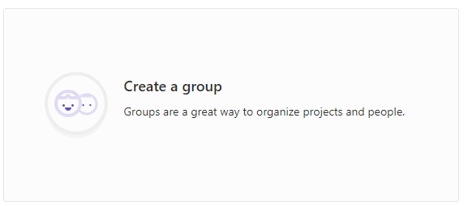
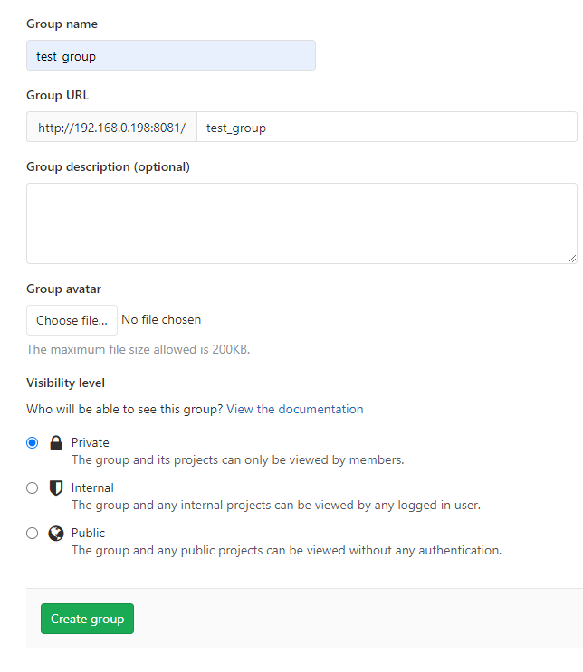
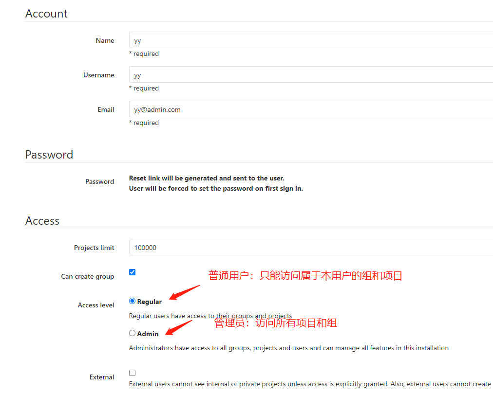
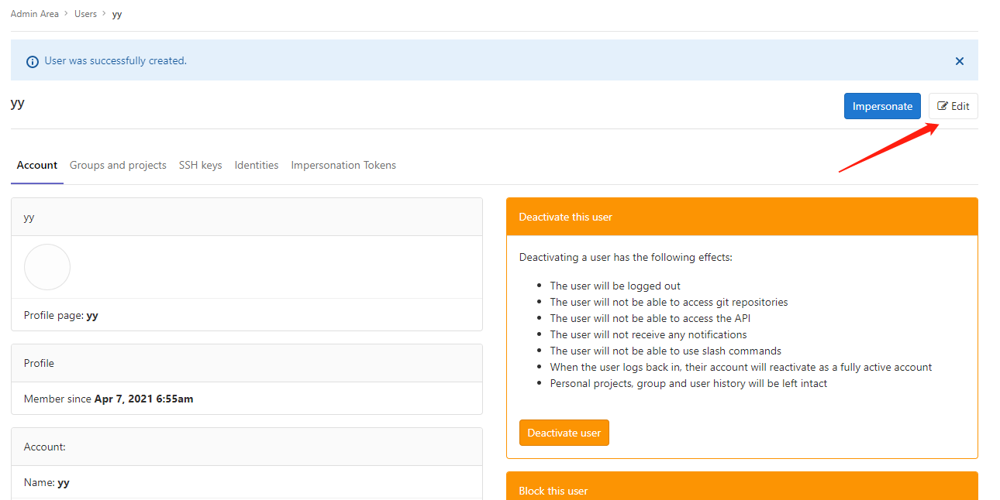
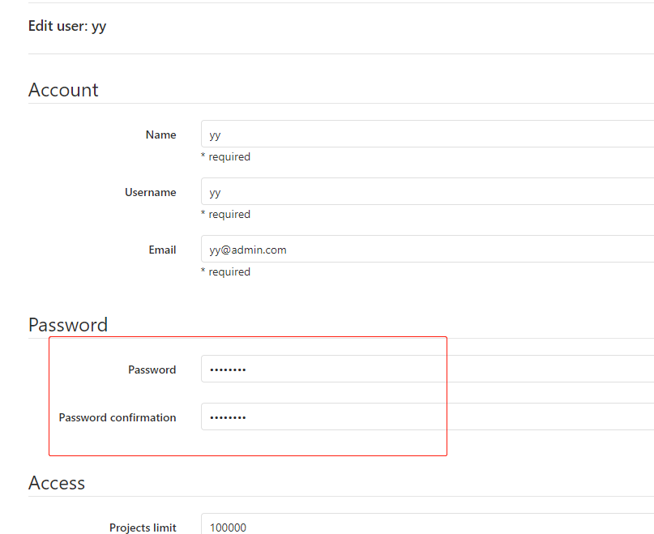
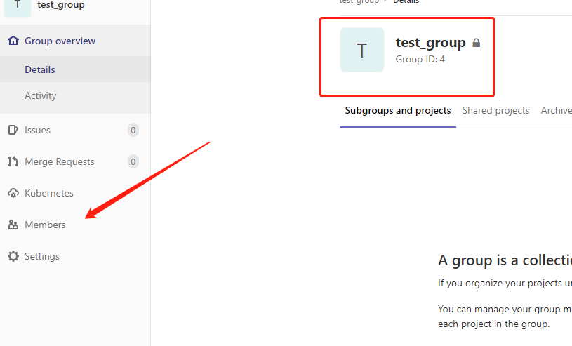
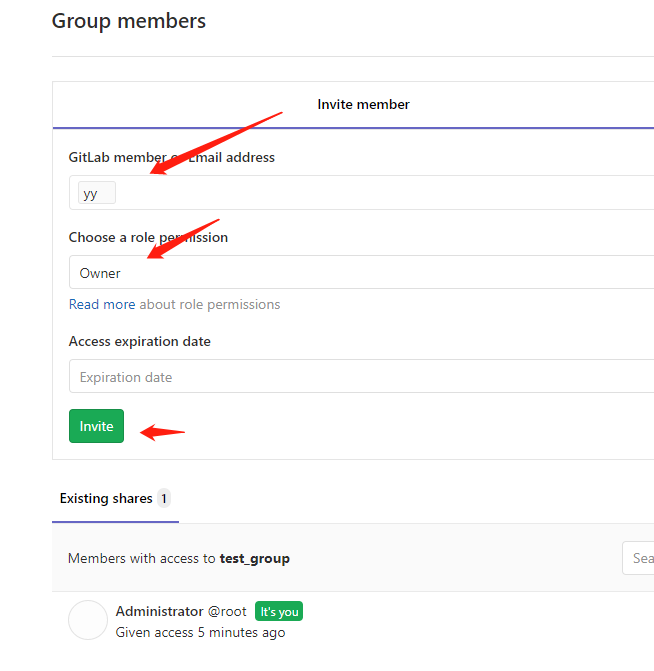
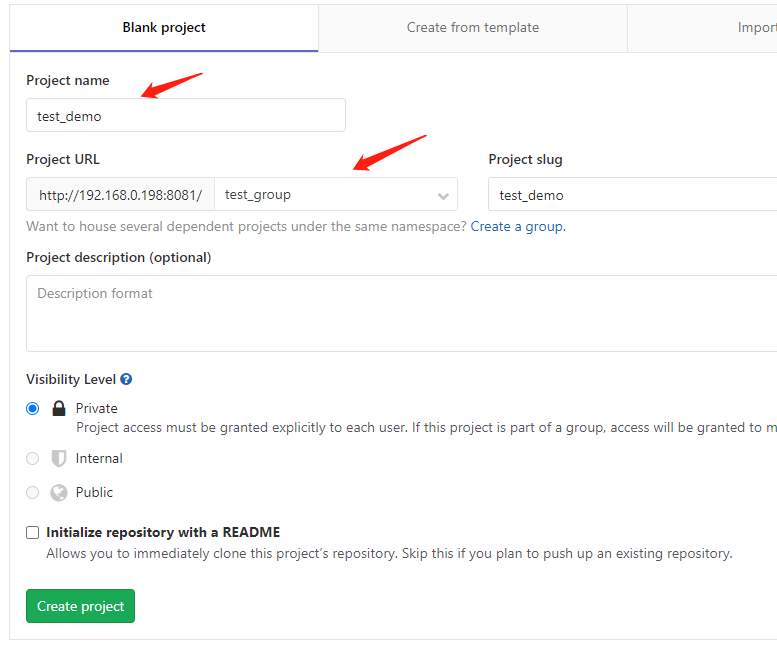
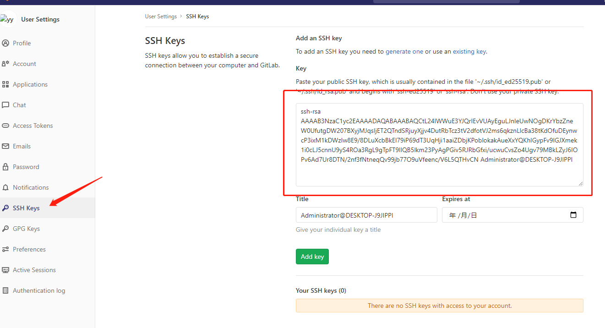
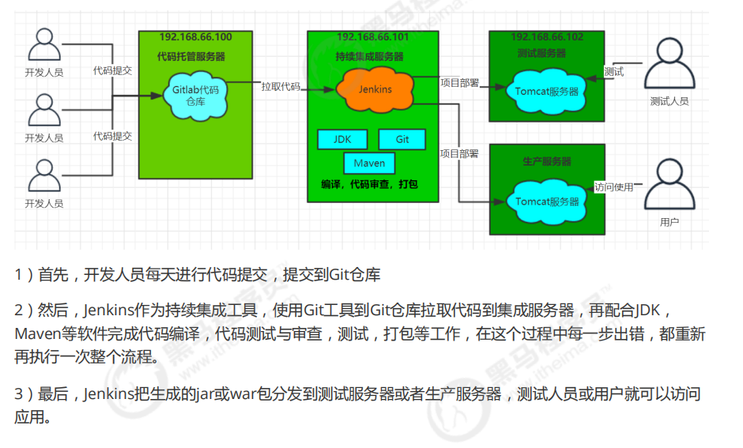

## Gitlab安装
### 安装依赖软件
```bash
## 相关依赖
yum install -y policycoreutils openssh-server openssh-clients postfix

## 设置postfix开机启动，postfix支持gitlab发信功能
systemctl enable postfix && systemctl start postfix
```
### 下载Gitlab包并安装
```bash
## 下载安装包
wget https://mirrors.tuna.tsinghua.edu.cn/gitlab-ce/yum/el7/gitlab-ce-12.10.10-ce.0.el7.x86_64.rpm

## 安装
rpm -ivh gitlab-ce-12.10.10-ce.0.el7.x86_64.rpm
```
### 修改配置文件并启动
```bash
## 修改配置文件，主要是修改端口，默认为80
vim /etc/gitlab/gitlab.rb
## 修改为如下：
external_url 'http://192.168.0.198:8081'
nginx['listen_port'] = 8081

## 重新加载配置文件&&启动
gitlab-ctl reconfigure
gitlab-ctl restart
```
### 设置默认密码
- 等待启动完成后访问`http://192.168.0.198:8081`,首次访问需要按提示设置`root`密码

### 502错误
- 一开始端口改成`8080` 发现一直502,原来是服务自带tomcat服务，设置成`8080`一只占用了，所以服务起不来

## Gitlab管理
### 创建组
- 使用管理员 root 创建组，一个组里面可以有多个项目分支，可以将开发添加到组里面进行设置权限，
不同的组就是公司不同的开发项目或者服务模块，不同的组添加不同的开发即可实现对开发设置权限的
管理





### 创建用户
- 创建用户的时候，可以选择Regular或Admin类型。



- 创建完成后，立即为用户创建密码





### 用户添加到组
- 选择某个用户组，进行Members管理组的成员





- Gitlab用户在组里面有5种不同权限：
- Guest：可以创建issue、发表评论，不能读写版本库
- Reporter：可以克隆代码，不能提交，QA、PM
可以赋予这个权限
- Developer：可以克隆代码、开发、提交、push，普通开发可以赋予这个权限
- Maintainer：可以创建项目、添加tag、保护分支、添加项目成员、编辑项目，核心开发可以赋予这个
权限
- Owner：可以设置项目访问权限 - Visibility Level、删除项目、迁移项目、管理组成员，开发组组
长可以赋予这个权限

### 创建项目
- 用户组中创建新的项目



### 上传测试代码
-  添加gitlab sshkey



- 初始化git仓库及配置远程地址

```bash
## 新建目录，执行如下，注意这里使用git非http,因为已经添加sshkey
git config --global user.name "yy"
git config --global user.email "yy@admin.com"
git init
git remote add origin git@192.168.0.198:test_group/test_demo.git
```
- 将测试代码上传至gitlab

```bash
git add .
git commit -m "add"
git push -u origin master
```
## Jenkins安装及集成环境
### 持续集成流程


###
