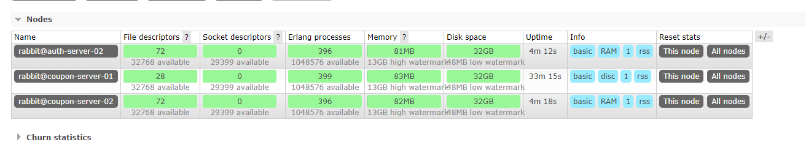

## 主机规划

| hostname           | ip        |    模式 |
| -------------|-------------| -----|
| coupon-server-01|192.168.0.77  | DISC
| coupon-server-02     | 192.168.0.78   | RAM     |     
|auth-server-02 | 192.168.0.76| RAM |

## 软件版本
- erlang-21.1.2-1
- rabbitmq-server-3.7.14-1

## 下载地址
```bash
wget --content-disposition https://packagecloud.io/rabbitmq/erlang/packages/el/7/erlang-21.1.2-1.el7.centos.x86_64.rpm/download.rpm

wget https://github.com/rabbitmq/rabbitmq-server/releases/download/v3.7.14/rabbitmq-server-3.7.14-1.el7.noarch.rpm
```

## 安装
### 软件安装
- 三台主机分别安装erlang rabbitmq-server

```bash
yum install erlang-21.1.2-1.el7.centos.x86_64.rpm -y
yum install rabbitmq-server-3.7.14-1.el7.noarch.rpm -y
```

- 启动服务并设置开机启动

```bash
systemctl start rabbitmq-server.service
systemctl enable rabbitmq-server.service
```

### 创建用户并授权
- 创建用户授权

```bash
# 在coupon-server-01节点操作
rabbitmqctl add_user root fjL1jY9qYEH6HgpZ
rabbitmqctl set_user_tags root administrator
rabbitmqctl set_permissions -p / root ".*" ".*" ".*"

#查看用户
rabbitmqctl list_users
```

- 删除guest用户

```bash
rabbitmqctl delete_user guest
```

### 登录web管理端

- 安装插件

```bash
#三台分别安装
rabbitmq-plugins enable rabbitmq_management
```

- 配置DNAT访问

由于外网主机只有`运维管理` 一台，所以需要在`运维管理` 主机配置防火墙DNAT转换

```bash
# 将192.168.0.77 的15672映射为15675端口，暂时只映射一台
iptables -t nat -A PREROUTING -p tcp -m tcp --dport 15675 -j DNAT --to-destination 192.168.0.77:15672

#阿里云开放15675端口
```
- 访问

http://47.106.153.245:15675/

至此软件安装完成

## 配置集群
- RabbitMQ模式大概分为以下三种:
- (1)单一模式。
- (2)普通模式(默认的集群模式)。
- (3) 镜像模式(把需要的队列做成镜像队列，存在于多个节点，属于RabbiMQ的HA方案，在对业务可靠性要求较高的场合中比较适用)。
要实现镜像模式，需要先搭建一个普通集群模式，在这个模式的基础上再配置镜像模式以实现高可用。


### 集群配置
- 复制cookie信息

cookie信息包含了所有配置，例如用户，所有需要同步到coupon-server-02  auth-server-02

```bash
scp /var/lib/rabbitmq/.erlang.cookie coupon-server-02:/var/lib/rabbitmq/.erlang.cookie
scp /var/lib/rabbitmq/.erlang.cookie auth-server-02:/var/lib/rabbitmq/.erlang.cookie

#拷贝完成后一定要重启coupon-server-02  auth-server-02上的rabbitmq实例使cookie生效
systemctl restart rabbitmq-server.service
```

- 将coupon-server-02  auth-server-02 加入集群

```bash
# coupon-server-02  auth-server-02操作
rabbitmqctl stop_app
rabbitmqctl join_cluster --ram rabbit@coupon-server-01    # --ram 以内存模式
rabbitmqctl start_app
```

- 集群配置完成



### 设置镜像模式

- 任意节点执行

```bash
rabbitmqctl set_policy ha-all "^" '{"ha-mode":"all","ha-sync-mode":"automatic"}'
```
- 说明
name: 策略名称    
vhost: 指定vhost, 默认值 /    
pattern: 通过正则表达式匹配哪些需要镜像, ^为所有    
definition:         
ha-mode: 指明镜像队列的模式，有效值为 all/exactly/nodes
	all     表示在集群所有的节点上进行镜像，无需设置ha-params            
	exactly 表示在指定个数的节点上进行镜像，节点的个数由ha-params指定             
	nodes   表示在指定的节点上进行镜像，节点名称通过ha-params指定
ha-params:
ha-mode 模式需要用到的参数         
ha-sync-mode: 镜像队列中消息的同步方式，有效值为automatic，manually    
apply-to: 策略作用对象。可选值3个，默认all        
	exchanges 表示镜像 exchange       
	queues    表示镜像 queue        all       
	表示镜像 exchange和queue ➜  

### 测试方法

1.是否镜像

添加消息队列，查看是否为镜像同步

2.测试宕机

手动关闭节点，查看集群是否正常，启动后查看消息是否同步

## 安装web_stomp

```bash
#三台分别执行
rabbitmq-plugins enable rabbitmq_web_stomp
rabbitmq-plugins enable rabbitmq_web_stomp_examples
systemctl restart rabbitmq-server.service

#检查61613端口是否监听
lsof -i:61613
```

## 配置Nginx代理ram节点

```bash
upstream rabbitmq {
        server 192.168.0.78:5672 max_fails=2 fail_timeout=3s weight=1;
        server 192.168.0.76:5672 max_fails=2 fail_timeout=3s weight=1;
        }
upstream stomp {
        server 192.168.0.78:61613 max_fails=2 fail_timeout=3s weight=1;
        server 192.168.0.76:61613 max_fails=2 fail_timeout=3s weight=1;
        }


server {
      listen 5678;
      proxy_connect_timeout 20s;
      proxy_timeout 5m;
      proxy_pass rabbitmq;
        }
server {
      listen 5679;
      proxy_connect_timeout 20s;
      proxy_timeout 5m;
      proxy_pass stomp;
        }

```
